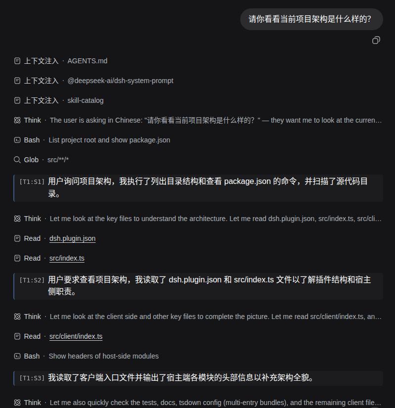

# dsh-recap

[DeepSeek Harness](https://github.com/deepseek-ai/DeepSeek-Harness)（DSH）的会话回顾总结插件：把**每一次模型请求（turn:step）新增的数据**总结成一句话，按时间顺序追加成一条「回顾链」——不必重放整个对话，即可看清这个会话做了什么。

设计要点：

- **缓存友好的增量生成**。第 k 次总结请求的输入由三部分组成：固定的 system 指令＋已有句子 1..k-1（逐字作为前缀）＋本次新增数据 Δk。相邻两次请求的输入只在最新一句之后才开始不同，因此**除 Δk 外的输入几乎全部命中 provider 的前缀缓存**；历史以已总结的句子形式进入提示词，输入长度每次调用仅增长约 40 token（若重放原始数据则约 640 token），长会话不会超出上下文窗口。
- **对 agent loop 零侵入**。捕获是 `session/event` 的只读监听；生成是与主循环并行的辅助 `ctx.llm.stream` 调用（`purpose: 'recap'`，任何观察者均可据此过滤）；**不向会话日志写入任何事件、不注入消息**——持久化走插件自有文件（`~/.dsh/recap/sessions/<sessionId>.jsonl`）。
- **无思考生成**。总结调用默认 `reasoningEffort: 'off'`（DeepSeek 适配器映射为 `thinking: disabled`）；不支持 `off` 的路由自动降级为 `low`，并按路由记住该选择。
- **总结路由由用户指定**。设置页的 `recap` 分区可单独指定 provider 与 model——总结任务无需强模型，指定一个低成本模型即可；未指定时先跟随会话当前路由，再退到宿主默认模型。

## 界面

<p align="center">
  :S<step>] 坐标前缀的浅色卡片）穿插在对话流的工具调用节点之间">
</p>

- **对话内联回顾行（独立运行，不依赖其他插件）**：每句总结**穿插在模型回复之间**——直接插在产生它的那次模型请求的全部内容（回复文本与工具调用行）之后，而不是集中列在轮末。某次请求的行未渲染（例如请求被中断）时，回退到同一 turn 内更早的请求行。默认 `step-end` 触发：请求结束后（约 1.5 秒防抖）即开始总结，结果在下一次轮询（2.5 秒间隔）内出现在对应位置；页面隐藏时轮询暂停。
- **设置页**：插件在 DSH 设置界面注册「会话回顾」分区，提供启用开关、总结间隔、provider、model 与思考等级，经插件自有的 `/recap/api/settings*` 路由读写（DSH 的 settings RPC 不向配置客户端开放第三方命名空间），修改实时生效。provider/model 为级联下拉（数据来自 `/recap/api/providers`，后者调用 `ctx.llm.listProviders/listModels` 并按 provider 缓存；列表加载失败时降级为手动输入）。

## 安装（从源码）

前置条件：DSH 已安装（`dsh web` 可运行），Node.js ≥ 22.13，pnpm ≥ 10。

```sh
# 1. 克隆并构建
git clone https://github.com/Howardzhangdqs/dsh-recap.git ~/Code/dsh-recap
cd ~/Code/dsh-recap && pnpm install && pnpm build

# 2. 在 ~/.dsh/profiles/web/package.json 的 dependencies 中添加本地依赖
#    "dsh-recap": "link:/home/you/Code/dsh-recap"

# 3. 在 ~/.dsh/profiles/web/cordis.patch.yml 中追加挂载条目
#    - insert:
#        - id: recap
#          name: 'dsh-recap'

# 4. 安装并重启
cd ~/.dsh/profiles/web && pnpm install
```

完成后重启 DSH 并强制刷新页面（Cmd/Ctrl+Shift+R）。

### GitHub 通道（`dsh plugin` 一键安装）

`dsh plugin add` 接受任意 pnpm 依赖形式；本插件**不发布 npm**，请使用 GitHub Release 的预构建 tarball 安装。包内的 `dsh.bundle` 声明（cordis.patch.yml）会让 `dsh plugin` 自动完成挂载；若 profile 中已有人工添加的挂载条目（即上面的源码安装方式），请先删除，避免重复挂载。

每个版本都会在 [GitHub Release](https://github.com/Howardzhangdqs/dsh-recap/releases) 附带 `pnpm pack` 产出的预构建 tarball（含 `lib/` 构建产物与 `dsh.plugin.json`，不含 sourcemap）；pnpm 安装远程 tarball 时不执行构建脚本，因此安装的就是附件中的产物：

```sh
dsh plugin --profile web add https://github.com/Howardzhangdqs/dsh-recap/releases/download/v0.1.0/dsh-recap-0.1.0.tgz
```

升级时修改 URL 中的版本号重新执行即可。

## 配置

### 挂载行配置（cordis.yml，部署级）

| 键 | 默认 | 说明 |
|---|---|---|
| `trigger` | `step-end` | 触发时机：`step-end`（每个请求结束时触发，句子随请求生成）/ `turn-end`（turn 结束后经防抖合并成批）/ `manual`（仅手动） |
| `debounceMs` | `1500` | 触发后的防抖窗口 |
| `textBlockLimit` | `4096` | Δ 内单条消息文本的截断上限（字节，UTF-8 安全） |
| `toolResultLimit` | `2048` | 工具结果的截断上限 |
| `toolArgsLimit` | `1024` | 工具调用参数的截断上限 |
| `historyMaxSentences` | `400` | 提示词携带的最大历史句数（超出时折叠最旧的句子） |
| `storeMaxEntries` | `500` | 每个会话的落盘条数上限（超出时压缩存储文件） |
| `maxPending` | `200` | 待总结 Δ 的数量上限（超出时合并最旧的条目，即背压保护） |
| `requestTimeoutMs` | `60000` | 单次总结调用的超时时间 |
| `retryBackoffMs` | `30000` | 限流退避基数：生成请求遇到 `RATE_LIMIT`（如 zai 的 429/1305「访问量过大」）时，该条 Δ 会**原样重新排到队首**等待重试——不记录失败条目，回顾链不会留下永久缺口。等待时长按指数增长（连续限流时每次翻倍，上限为基数的 32 倍）；等待期间，对应位置的行内状态标识（chip）会显示「限流等待中，Ns 后重试…」 |
| `maxTokens` | `120` | 单句输出的 token 上限 |
| `toolsEnabled` | `false` | 是否注册模型工具（默认关闭：工具 schema 会随会话请求发送） |
| `storeDir` | `~/.dsh/recap/sessions` | 存储目录覆盖 |

> ⚠️ 截断与提示词结构相关的参数是缓存前缀的组成部分——回顾链生成途中修改这些参数会使前缀缓存失效（一次性代价）。

### 用户设置（设置页 `recap` 分区，实时生效）

| 键 | 默认 | 说明 |
|---|---|---|
| `enabled` | `true` | 总开关（关闭时暂停生成，Δ 继续积累） |
| `interval` | `1` | 总结粒度：每 N 个请求的新增数据合并总结为**一句**（1 表示每个请求一句）。调大后句子标识为 `[T<turn>]`（对应所覆盖的请求区间）；调小后，下一个请求立即恢复细粒度总结 |
| `provider` + `model` | 未设置 | 总结专用路由（两者必须成对设置）；未设置时先跟随会话路由，再退到宿主默认模型 |
| `effort` | `off` | `off`（关闭思考）→ `low`（低思考）→ `follow`（跟随适配器默认）三级阶梯：路由拒绝当前档位时自动降档，并按路由记住生效档位；模型没有 effort 词表时最终省略该字段 |

#### 「关闭思考」（off）真正生效的条件

`effort: off` 是否显式发送「禁用思考」，由**路由的适配器与模型声明**决定，不在本插件：

- **DeepSeek 官方路由**：适配器内置映射，`off` → `thinking: {type: "disabled"}`，开箱即用。
- **pi-ai 路由（zai 等）**：模型的 effort 档位来自 settings 文档（`llm-pi-ai.providers.<route>.models[].reasoningEfforts`），且**未声明的档位一律视为不支持**：
  - 条目完全没有 `reasoningEfforts`、又不在 pi-ai 内置目录中的模型，会被视为**非思考模型**——请求中不写入 `thinking` 字段（是否思考取决于服务端默认行为）；
  - 要显式关闭思考，需在模型条目中声明 `off` 档；YAML **空值**写法（`off:` 留空）表示「支持关闭：发送时省略参数」，zai 格式会序列化为 `thinking: {type: "disabled"}`。注意：只声明 `off` 一个档位会被校验拒绝，必须同时声明至少一个思考档位：

    ```yaml
    reasoningEfforts:
      off:        # 空值 = 支持关闭：发送时省略参数（zai 格式 → thinking: {type: disabled}）
      low: low
      high: high
    ```

  - 路由不支持 `off` 时（档位表未声明），本插件的降档阶梯会**静默**退到 `low` 或省略该字段——此时「关闭」并未真正生效，但不会报错；排查时请先检查该模型的 `reasoningEfforts` 声明。

## 模型工具（默认关闭）

开启 `toolsEnabled` 后注册两个工具（作用域绑定到发起调用的 agent 所在会话）：

- `recap_read(limit?)` — 读取回顾链（新句在前）
- `recap_refresh()` — 立即排空待总结队列

## HTTP API

`POST /recap/api/<method>`（JSON body；与 `/api` 使用相同的浏览器信任校验）：

| 方法 | 说明 |
|---|---|
| `list` | `{sessionId, limit?}` → 返回条目列表（新的在前）、汇总信息（句数、缓存命中率、用量）与队列状态 |
| `generate` | `{sessionId}` 手动触发排空队列 |
| `stats` | `{sessionId}` 队列、存储与设置的快照 |
| `clear` | `{sessionId}` 清空回顾链 |
| `settings` / `settings.update` | 读写用户设置（带 revision 并发守卫） |
| `providers` | 列出 provider（或某个 provider 的模型），供选择器使用 |

## 架构

```
session/event ──▶ capture（seed 回放 + live 镜像，按消息 id 幂等去重）
                      │ 每 step 的 Δ（新增数据，确定性截断 + JSON 结构化封装）
                      ▼
                 queue（会话内串行、跨会话并行、背压合并、失败容错）
                      │ history = store 中的句子（逐字节复用为前缀）
                      ▼
                 generator（ctx.llm.stream 辅助调用，purpose:'recap'，
                      │    reasoningEffort off→low，超时控制）
                      ▼
                 store（~/.dsh/recap/sessions/<sid>.jsonl，追加写 + 压缩）
```

单一包内分为宿主端与客户端两部分（host + client），工程组织与 [dsh-dashboard](https://github.com/Howardzhangdqs/dsh-dashboard) 一致：`src/` 为宿主端（捕获、队列、生成、存储、HTTP 路由、模型工具），`src/client/` 为浏览器端（对话内联回顾行、设置分区、i18n）；`tsdown` 产出双通道 client bundle（profile 名 `dsh-recap` 与注册表 id `dsh-external/dsh-recap`）。

## 缓存命中分析（设计依据）

第 k 次调用的输入 = `system（固定）＋ 句子行 1..k-1 ＋ Δk ＋ 固定结尾指令`。相邻两次调用共享 `system + 句子行 1..k-1` 这个逐字节相同的前缀，因此除 Δk（本来就必须输入的新数据）与一行新句外，其余输入**全部命中缓存**。对比两种替代方案：

- 全链多轮（重放全部历史 Δ 原文）：输入随步数线性增长（约 640 token/步），长会话会超出上下文窗口；
- Δ 前置（新增数据放在提示词开头）：每次调用的输入从开头就不同，前缀缓存几乎完全无法命中。

完整设计说明见 [docs/design.md](./docs/design.md)。

## 开发

```sh
pnpm install
pnpm typecheck   # tsc --noEmit
pnpm test        # vitest（覆盖 capture/store/generator/queue 的单测）
pnpm build       # tsc 类型声明 + tsdown bundle
```

## License

MIT
